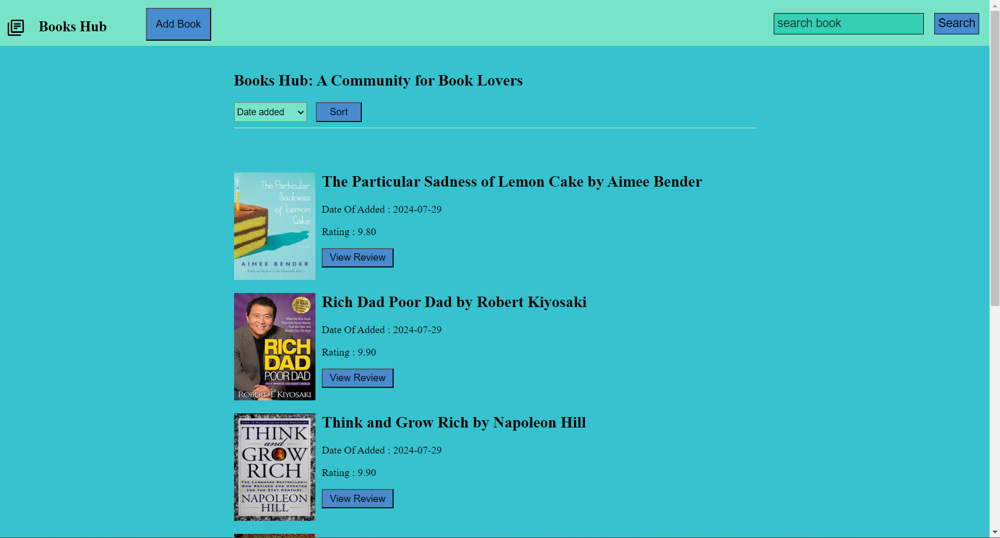
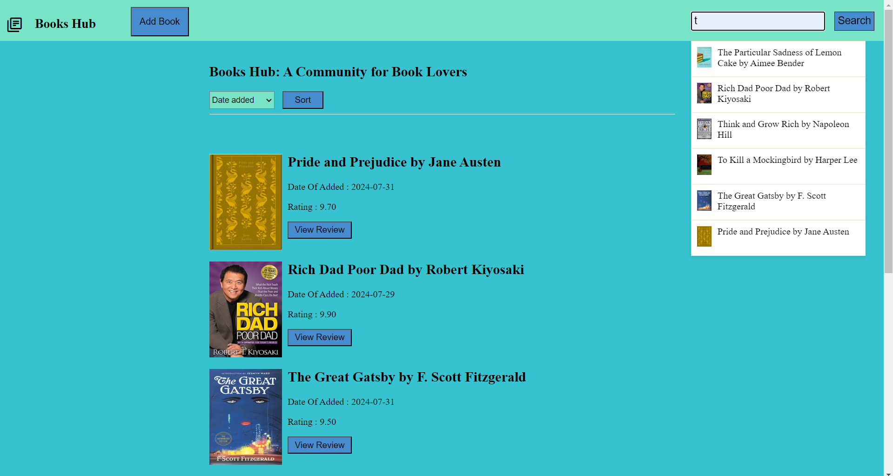
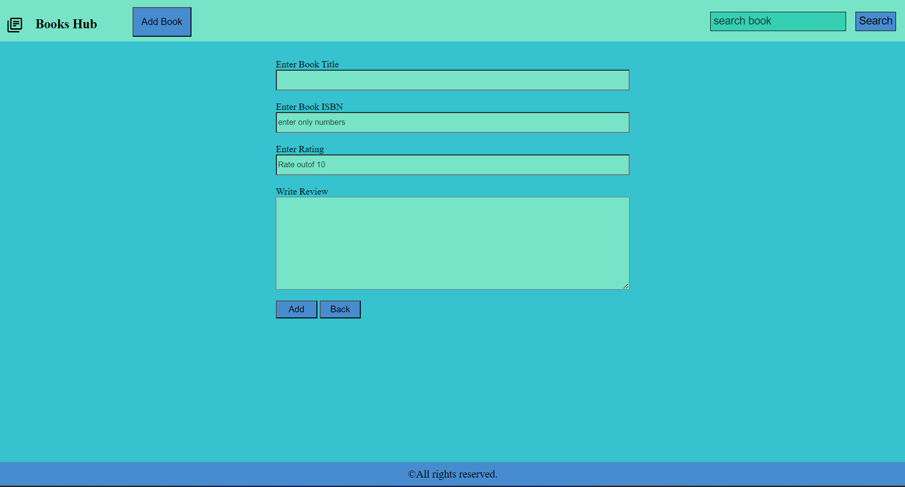
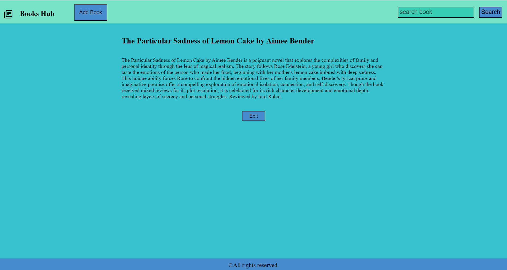

Project title : Book Hub

Project Description: BookHub is a platform that empowers users to discover, explore, and share their love for books. 
Users can effortlessly add books with essential details like ISBN, ratings, and insightful reviews. 
The platform's intuitive search and sorting functionalities enable users to discover new books based on their preferences. 
Additionally, users have the flexibility to edit their reviews, ensuring their thoughts accurately reflect their opinions.

Key Features:
1. Book Addition: Users can add new books to the platform, including ISBN, rating, and detailed reviews.
2. Book Discovery: Users can explore a vast collection of books through search and sorting options.
3. Review Management: Users can edit their existing book reviews to maintain accuracy.

